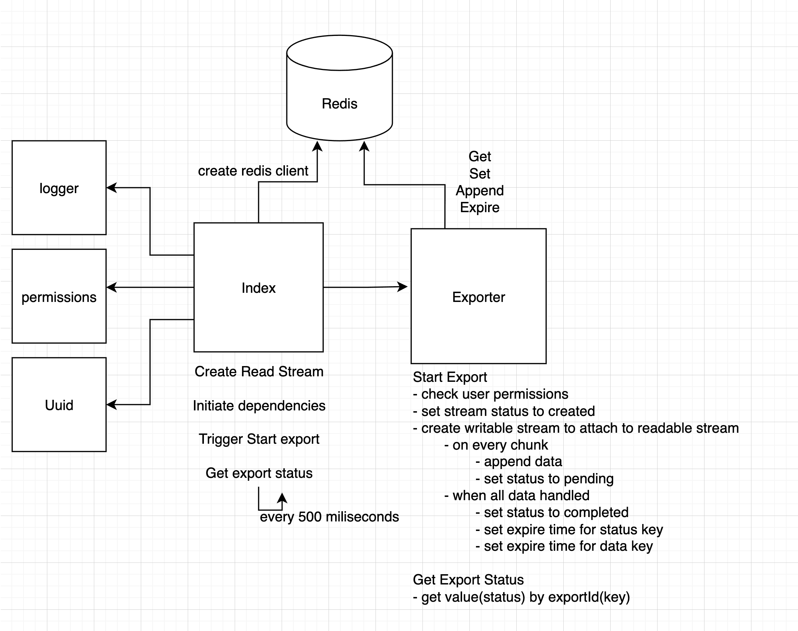

# Heartbeat engineering challenge

## Tasks

### Task 1

---

**System Architecture**



**Description**

1. Creates redis client using
2. Open a mock file by creating a readable stream by calling `mockOpenFile()`
3. Set and initiate all exporter dependencies which includes:

```
cache: RedisClient;
permissionsService: PermissionsService;
allowedPermission: string;
UUIDGen: UUID;
logger: Logger;
```

5. Populate dependencies and trigger start export method using `exporter.StartExport`

```
Input => (user: User, data: Stream)
Output => { status: string; id: string; }
```

6. Get export status every 500 milliseconds `exporter.GetExportStatus`

```
Input => (id: string)
Output => { status: string; id: string; }
```

**How `StartExport` works:**

1. Checks the user permissions using
   ```
   CheckPermissions: async (user, permission) =>
   user.permissions.includes(permission),
   ```
2. Sets key (exportId) in redis with the value `{ status: "CREATED", id: exportId, }`
3. Attach writable stream to readable stream using `data.pipe(newCacheWriter(exportId, deps.cache))`
4. Create writable stream and write data to cache using `newCacheWriter()`
   ```
   Input => (exportId: string, cache: RedisClient)
   Output => Writable stream
   ```
   1. `write()` method of writable stream writes data to stream and chunks will be appended to `{id}-data` key
      1. set status PENDING until all data is handled
   2. After all data is handled `final()` executes
      1. set status to COMPLETE
      2. set expiry times to the keys

**How `GetExportStatus` works:**

1. Gets value from cache using key (Id)
2. If key does not exist throws error else parse the value and returns

**How custom `Logger` works:**

NewMockLogger has a return type `Logger` which actually holds two things:

1. Holds the function which accepts three inputs as specified below and logs
   the custom input. But the important thing to note here it `only logs the tags but does not update them for future logs`.

```
(
   message: Stringable,
    fields?: { [key: string]: Stringable },
    ...tags: Stringable[]
  ): void
```

Example execution/demonstration is below

```
deps.logger('........... best',{},"1","2");
//logs: tags: exporter|1|2, message: ........... best, fields:

deps.logger('........... best222');
//logs: tags: exporter, message: ........... best222, fields:

```

2. The second important thing is tag key of type

```
 tag: (...tags: Stringable[]) => Logger;
```

the tricky thing here is NewMockLogger maintains the `old tags` which is update and dats is pushed
into it, and for any future logging these tags will also appear. Example below:

```
deps.logger.tag("1","2","3");

deps.logger('........... best',{},"1","2");
//logs: tags: exporter|1|2|3|1|2, message: ........... best, fields:

deps.logger('........... best222');
//logs: tags: exporter|1|2|3, message: ........... best222, fields:
```

---

### Task 2a 🛠

---

Done.

### Task 3 📈

---

###Improvements
**Separation of concerns**

This refers to the fact of assigning separate responsibility to each component, function or class. In
our service there are multiple occasions where components can be divided into specialized components.
We can take the example or `exporterDeps` where each dependency have completely different concern to cater.
The best part of separation of concern is `Code Reusability` like for example this

```
util.promisify(cache.Method).bind(Context)
```

instead of initiating and calling again and again we can define a generic method in a separate
redis config file which we will discuss in SRP below.

**Loose coupling**

In my perspective our code have a really high coupling lets take an example of this one single
line of code

```
 const exporter = HBExporter(exporterDeps);
```

If we brake down this line, we can make a proper tree of relationships that shows the
tightly coupled `Composition`(if we refer to the definition of composition, which is, objects contained
in another object and cant exists alone). For example

```
   const exporterDeps: HBExporterDependencies = {
    cache: redisClient,
    UUIDGen: MockUUIDGen,
    allowedPermission: "exporter",
    permissionsService: MockPermissions,
    logger: NewMockLogger("exporter"),
  };
```

As shown in our above architectural diagram Index is the bottleneck for exporter service,
we can separate these dependencies and can use `Association` or `Aggregation` relation directly
with our exporter functionalities.

**Single responsibility principle**

Every class, method, or module should have a single responsibility, it
may seem identical to the ‘single responsibility principle’, it’s not.
Single responsibility says that every class or function should have its
own responsibility. Separation of concerns says that you should break that
single responsibility into smaller parts that have each their own responsibility.

so taking all this into account i would prefer to have a separate file/class/module
of a Redis configuration which provides all this generic methods to call and initiates
the client.

**Performance**

If we look at the `time and space complexity` of this service the operations such as
below are exhausting it because it is stuck in an infinite loop:

```
 while (1) {
    await sleep(500);
    const res = await exporter.GetExportStatus(MockUUIDGen.NewUUID());
    console.log(res);
  }

  - its better to stop it when stream completed or cancelled

  let res;
  do {
     await sleep(500);
     res = await exporter.GetExportStatus(MockUUIDGen.NewUUID());
     console.log(res);
  } while(res.status !== "COMPLETED" || res.status !== "CANCELLED" )

```

**Simplicity**

In our service we have used compound function inside an object multiple
times which heavily effects readability. So I think we can write it in
a more simpler and efficient way.

## How to submit

1. Create a private fork of this repository
2. Create a new branch in your fork
3. Commit on that branch
4. When you are ready to submit, create a PR back to your fork
5. Add the user @heartbeat-med (https://github.com/heartbeat-med)
6. We will comment on the PR
7. You can either submit more code or we can discuss in the next interview 🤘
8. Any questions, reach out to us!

## Start the application

Run the example with:

```shell
yarn start
```

Format code:

```shell
yarn format
```
